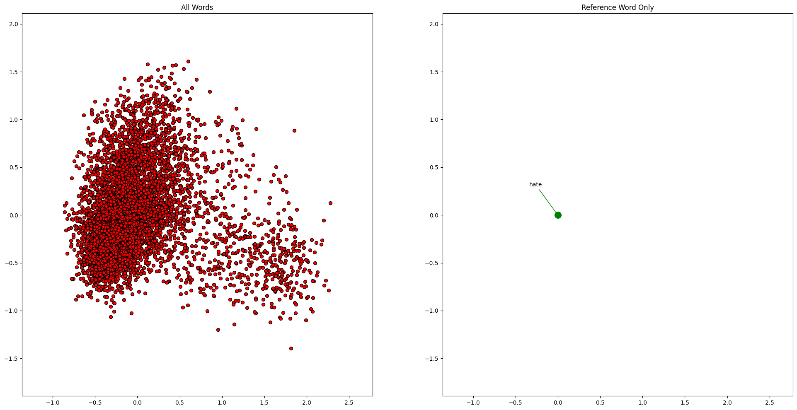
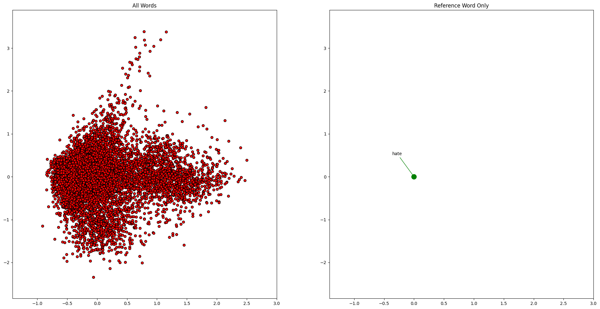
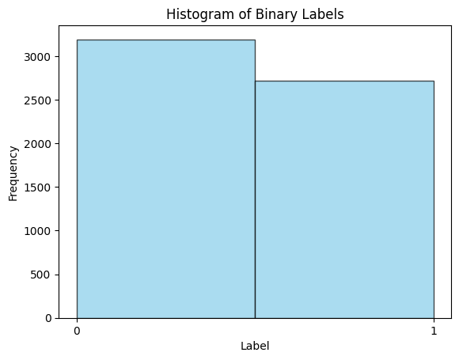
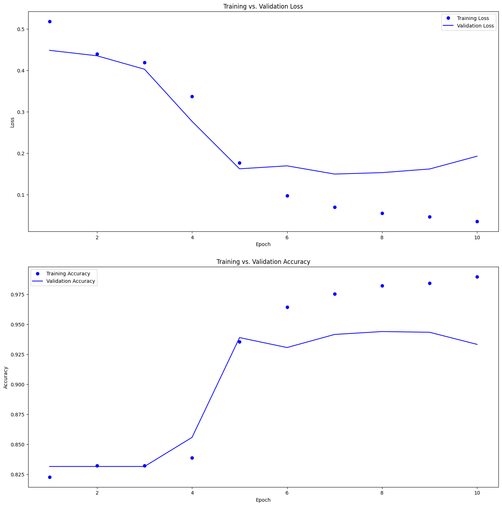
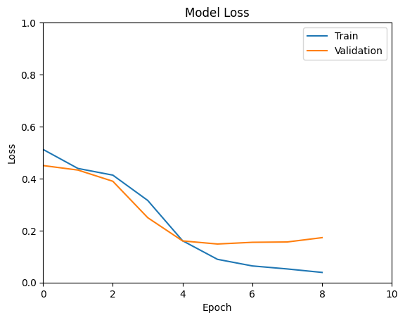
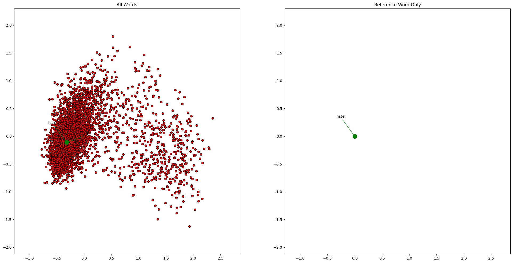

# Hate Speech Regonition using Simple ANN Model

Data Preprocessing: The model starts with preprocessing the text data. This involves tokenizing the text, converting words into numerical tokens, and padding sequences to make them of equal length.

Embedding Layer: The model uses an embedding layer to map each word token to a dense vector representation. This layer learns the relationships between words based on their context in the training data. The embedding layer is initialized with pre-trained word embeddings like GloVe or Word2Vec.

Training: The model is trained using binary cross-entropy loss and the Adam optimizer. During training, the model adjusts its parameters (embedding weights, dense layer weights) to minimize the loss function, thus improving its ability to classify hate speech.

Evaluation: The model's performance is evaluated on a separate test set using metrics like accuracy, precision, recall, and F1-score. These metrics measure how well the model generalizes to unseen data and its ability to correctly classify hate speech.

Overall, the model learns to classify text as hate speech or non-hate speech based on the patterns and relationships present in the training data, as captured by the word embeddings and learned parameters of the neural network layers.

## Data Sets
Source:- 
            https://www.kaggle.com/datasets/mrmorj/hate-speech-and-offensive-language-dataset
            https://www.kaggle.com/datasets/wajidhassanmoosa/multilingual-hatespeech-dataset      

This is raw Dataset.

In preprocessing :-

    1. remove_punctuation()
    2. preprocess_tweet(tweet):
    3. remove_non_content_words(text)
    4. remove_entities(text)
    
Here is a scatter plot of all the Unique words after preprocessing of Training Dataset

Scatter plot of Testing Dataset 

Histogram of Two Label 0/1 where
    0 represents Non-Hate
    1 represents Hate        
    

## ANN model that was Used
    from sklearn.model_selection import train_test_split
    
    X = df["text"]
    y = df["label"]
    X_train, X_test, y_train, y_test = train_test_split(X, y, test_size=0.2, random_state=42)
    
    print("Training set shape:", X_train.shape, y_train.shape)
    print("Testing set shape:", X_test.shape, y_test.shape)
    
    tokenizer.fit_on_texts(X_train)
    MAX_REVIEW_LEN = 200
    X_train = tokenizer.texts_to_sequences(X_train)
    X_train = keras.preprocessing.sequence.pad_sequences(X_train, maxlen=MAX_REVIEW_LEN)
    X_test = tokenizer.texts_to_sequences(X_test)
    X_test = keras.preprocessing.sequence.pad_sequences(X_test, maxlen=MAX_REVIEW_LEN)
    
    num_tokens = len(tokenizer.word_index) + 1
    embedding_dim = 300
    embedding_matrix = np.zeros((num_tokens, embedding_dim))
    
    for word, i in tokenizer.word_index.items():
        if word_vectors.has_index_for(word):
            embedding_matrix[i] = word_vectors[word].copy()
    
    embedding_layer = layers.Embedding(
        num_tokens,
        embedding_dim,
        embeddings_initializer=keras.initializers.Constant(embedding_matrix),
        input_length=MAX_REVIEW_LEN,
        trainable=True
    )
    
    model = keras.Sequential()
    model.add(embedding_layer)
    model.add(layers.GlobalAveragePooling1D())
    model.add(layers.Dense(128, activation='relu'))
    model.add(layers.Dense(64, activation='relu'))
    model.add(layers.Dense(1, activation='sigmoid'))
    
    model.compile(optimizer='adam', loss='binary_crossentropy', metrics=['accuracy'])
    
    es_callback = keras.callbacks.EarlyStopping(monitor='val_loss', patience=3)
    history = model.fit(X_train, y_train, epochs=20, batch_size=512, validation_data=(X_test, y_test), callbacks=[es_callback])

A graph between Training and Validation Curves

Model Loss Curve: Compares the Loss of each epoch 
Accuracy shoots up in 3rd epoch.

## Results

The overall Accuracy of model was 0.94 however when tested on a completely new dataset with unseen datapoints, Accuracy decreases to 0.52

Here is a Intersection plot of Both Datasets visualizing new datapoints

## Example

In this example there as two sentences with the following probability:

            Sentence: The food was so shit and horrible I want to kill the chef.
            Probability of being hate speech: 0.9985871315002441
            
            Sentence: You are the most amazing person that I ever met.
            Probability of being hate speech: 0.05440551042556763

Hence, The model is very succesful in predicitng direct Hate speech.
